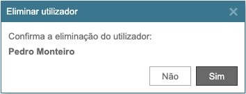

.. index:: Ask Box

.. _askbox:

Ask Box
=======

Este componente mostra uma pergunta, disponibilizando até 3 botões de resposta.

| 
| É construído em **runtime** com base na seguinte informação:

Requisitos
----------
       
======================================= =================
``/framework/components/askbox.js``                       
``/framework/components/shield.js``     :ref:`shield`     
``/framework/components/formbutton.js`` :ref:`formbutton`
``/framework/components/shared.js``     :ref:`jsshared`     
======================================= =================

.. note:: As páginas geradas por :ref:`phppagehelper` fazem, por defeito, o carregamento dos componentes necessários.  

----

Html do componente (tag)
------------------------

.. important:: As páginas geradas por :ref:`phppagehelper` carregam, por defeito, um elemento ``<fwk-askbox>`` com o id="**fwk_askbox**".  

.. code:: html

    <fwk-askbox></fwk-askbox>

========== ================================= =========== ============== =======
Atributo   Descrição                         Obrigatório Opções         Default
========== ================================= =========== ============== =======
``id``     Identificador único do componente Sim         
``color``  Cor base  do componente           Não         "blue", "gray" "gray"
========== ================================= =========== ============== =======

----

Mostrar caixa de pergunta
-------------------------
.. code:: Javascript

    const obj_askbox = FormHelper.getComponent('fwk_askbox');
    let id = ?;
    let name = '???';
    obj_askbox.show = {
        color: 'blue',
        title: '???',
        question: '???',
        actions: [
            {caption: '???', color: "???"},
            {caption: '???', color: "???", function: {"deleteRecord":[[id], false]}}
        ]
    };

============ =========================================== =========== =============== =======
Parâmetro    Descrição                                   Obrigatório Opções          Default
============ =========================================== =========== =============== =======
``color``    Cor base (override)                         Não          "blue", "gray" "gray"
``title``    Título da box                               Sim         
``question`` Pergunta a colocar (admite html)            Sim        
``button``   Para cada botão: caption + color + function Sim        
============ =========================================== =========== =============== =======

----

Fechar caixa de pergunta
------------------------
.. code:: Javascript

   obj_askbox.show = false;

.. important:: Ver :ref:`formbutton` para detalhes de configuração de ``function`` ou ``script``.

----

Referências
-----------
:ref:`jsformhelper` é uma classe de auxílio às operações sobre formulários.