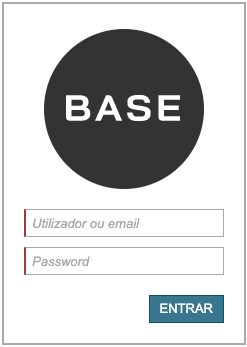

.. index:: Box 

.. _box:

Box
===

Este componente associa componentes dentro de uma box.

Requisitos
---------- 
       
=================================== ===============
``/framework/components/box.js``                      
``/framework/components/shared.js`` :ref:`jsshared`     
=================================== ===============

.. note:: As páginas geradas por :ref:`phppagehelper` fazem, por defeito, o carregamento dos componentes necessários.  

----

Html do componente (tag)
------------------------

.. code:: html

    <fwk-box>
        

            component
            component
            ...
        

    </fwk-box>

.. important:: O conteúdo admite html.

=========== ================================= =========== =============== =======
Atributo    Descrição                         Obrigatório Opções          Default
=========== ================================= =========== =============== =======
``id``      Identificador único do componente Sim (?)        
``hide``    Esconde componente                Não         "true", "false" "false" 
``color``   Cor base do componente            Não         "blue", "gray"  "gray"
``padding`` Preenchimento (=html)             Não                         "10px"
=========== ================================= =========== =============== =======

.. important:: O atributo ``id`` só é obrigatório no caso de ser necessária a identificação do componente para interacção com qualquer uma das suas funcionalidades.

=========== =========== =========== ===========
Slot        Descrição   Obrigatório Observações
=========== =========== =========== ===========
``content`` Componentes Sim         Admite html
=========== =========== =========== ===========

Funcionalidades
---------------

Assumindo que exite um objecto instanciado com o componente:

.. code:: Javascript

    const obj_box = FormHelper.getComponent('fwk_box');
    
Mostrar / esconder
^^^^^^^^^^^^^^^^^^
.. code:: Javascript

    obj_box.hide = false;
    obj_box.hide = true;

Ler estados
^^^^^^^^^^^
.. code:: Javascript

    let is_hide = obj_box.hide;

----

Referências
-----------

:ref:`jsformhelper` é uma classe de auxílio às operações sobre formulários.