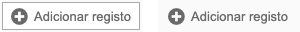

.. index:: Button

.. _button:

Button
======

Este componente executa um método, função ou script.

Requisitos
----------
         
=================================== =============== 
``/framework/components/button.js``
``/framework/components/shared.js`` :ref:`jsshared`     
=================================== ===============

.. note:: As páginas geradas por :ref:`phppagehelper` fazem, por defeito, o carregamento dos componentes necessários.  

----

Html do componente (tag)
------------------------

.. code:: html

    <fwk-button>
        <i slot="icon" class="fas fa-plus-circle"></i>
        texto
    </fwk-button>

==================== ================================= =========== =============== =======
Atributo             Descrição                         Obrigatório Opções          Default
==================== ================================= =========== =============== =======
``id``               Identificador único do componente Sim (?)        
``value``            Texto do botão                    Não         
``disable``          Inibe componente                  Não         "true", "false" "false" 
``hide``             Esconde componente                Não         "true", "false" "false" 
``color``            Cor base do componente            Não         "blue", "gray"  "gray" 
``border``           Com border                        Não         "false", "true" "false" 
``tooltip-position`` Posição do tooltip                Não         "left", "right" "right"
``function``         Função a executar no evento click Sim (?)     
``script``           Script a executar no evento click Sim (?)        
==================== ================================= =========== =============== =======

.. important:: 

    O atributo ``id`` só é obrigatório no caso de ser necessária a identificação do componente para interacção com qualquer uma das suas funcionalidades.

    Os atributos ``function`` e ``script`` são mutuamente exclusivos.

=============== ===================== =========== ===========
Slot            Descrição             Obrigatório Observações
=============== ===================== =========== ===========
``icon``        Icone de botão        Não
``information`` Tooltip de informação Não         Admite html
=============== ===================== =========== ===========

.. important:: O atributo ``value`` e a slot ``icon`` podem coexistir juntos no componente. Um deles deve obrigatóriamente ser utilizado.

----

Função de componente
--------------------

O atributo ``function`` destina-se a definir a chamada a uma função global ou a um método de classe. Os formatos permitidos são:

======================================== ============================================                                        
Função global (formatos)                 Método de classe (formatos)                             
======================================== ============================================
function = "newRecord"                   function = "obj.newRecord"                  
function = '{"saveRecord":[param1,...]}' function = '{"obj.saveRecord":[param1,...]}'
======================================== ============================================

----

Script de componente
--------------------

O atributo ``script`` destina-se a definir o script a ser executado. É permitido qualquer script válido.

----

Funcionalidades
---------------

Assumindo que exite um objecto instanciado com o componente:

.. code:: Javascript

    const obj_button = FormHelper.getComponent('fwk_button');

Valor (texto do botão)
^^^^^^^^^^^^^^^^^^^^^^
.. code:: Javascript

    obj_button.value = '???';

Mostrar / esconder
^^^^^^^^^^^^^^^^^^
.. code:: Javascript

    obj_button.hide = false;
    obj_button.hide = true;

Habilitar / inibir
^^^^^^^^^^^^^^^^^^
.. code:: Javascript

    obj_button.disable = false;
    obj_button.disable = true;

Iniciar / terminar processamento
^^^^^^^^^^^^^^^^^^^^^^^^^^^^^^^^
.. code:: Javascript

    obj_button.processing = true;
    obj_button.processing = false;

Ler estados
^^^^^^^^^^^
.. code:: Javascript

    let is_hide = obj_button.hide;
    let is_disable = obj_button.disable;

----

Referências
-----------

:ref:`jsformhelper` é uma classe de auxílio às operações sobre formulários.