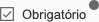

.. index:: Check Box

.. _checkbox:

Check Box
=========

Este componente permuta entre os estados ``true`` e ``false``.

Requisitos
----------
         
===================================== ===============
``/framework/components/checkbox.js``
``/framework/components/shared.js``   :ref:`jsshared`     
===================================== ===============

.. note:: As páginas geradas por :ref:`phppagehelper` fazem, por defeito, o carregamento dos componentes necessários.  

----

Html do componente (tag)
------------------------

.. code:: html

    <fwk-checkbox>
        texto
    </fwk-checkbox>

==================== ========================================= =========== ======================= =======
Atributo             Descrição                                 Obrigatório Opções                  Default
==================== ========================================= =========== ======================= =======
``id``               Identificador único do componente         Sim (?)        
``label``            Label do componente                       Sim   
``value``            Estado inicial                            Não         true", "false"          "false"
``disable``          Inibe componente                          Não         "true", "false"         "false" 
``hide``             Esconde componente                        Não         "true", "false"         "false" 
``color``            Cor base do componente                    Não         "blue", "gray", "white" "gray" 
``simple``           Reduz o componente à checkbox sem margens Não         "false", "true"         "false" 
``tooltip-position`` Posição do tooltip                        Não         "left", "right"         "right"
``function``         Função a executar no evento onchange      Não     
==================== ========================================= =========== ======================= =======

.. important::  O atributo ``id`` só é obrigatório no caso de ser necessária a identificação do componente para interacção com qualquer uma das suas funcionalidades.

=============== ===================== =========== ===========
Slot            Descrição             Obrigatório Observações
=============== ===================== =========== ===========
``information`` Tooltip de informação Não         Admite html
=============== ===================== =========== ===========

----

Função de componente
--------------------

| O atributo ``function`` destina-se a definir a chamada a uma função global ou a um método de classe.
| A função recebe, como parâmetro único, o novo estado (``true``ou ``false``).
| Os formatos permitidos são:

======================= ==========================                                        
Função global (formato) Método de classe (formato)                             
======================= ==========================
function = "onchange"   function = "obj.onchange"                  
======================= ==========================

----

Funcionalidades
---------------

Assumindo que exite um objecto instanciado com o componente:

.. code:: Javascript

    const obj_checkbox = FormHelper.getComponent('fwk_checkbox');

Atribuir valor
^^^^^^^^^^^^^^
.. code:: Javascript

    obj_checkbox.value = false / false;

Ler valor
^^^^^^^^^
.. code:: Javascript

    let value = obj_checkbox.value;

Mostrar / esconder
^^^^^^^^^^^^^^^^^^
.. code:: Javascript

    obj_checkbox.hide = false;
    obj_checkbox.hide = true;

Habilitar / inibir
^^^^^^^^^^^^^^^^^^
.. code:: Javascript

    obj_checkbox.disable = false;
    obj_checkbox.disable = true;

Ler estados
^^^^^^^^^^^
.. code:: Javascript

    let is_hide = obj_checkbox.hide;
    let is_disable = obj_checkbox.disable;

----

Referências
-----------

:ref:`jsformhelper` é uma classe de auxílio às operações sobre formulários.