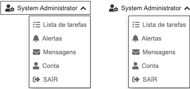

.. index:: Drop Button

.. _dropbutton:

Drop Button
===========

Este componente mostra um botão que acciona uma box em dropdown com outros componentes.

Requisitos
----------
         
======================================= ===============
``/framework/components/dropbutton.js`` 
``/framework/components/shared.js``     :ref:`jsshared`     
======================================= ===============

.. note:: As páginas geradas por :ref:`phppagehelper` fazem, por defeito, o carregamento dos componentes necessários.  

----

Html do componente (tag)
------------------------

.. code:: html

    <fwk-dropbutton>
        <i slot="icon" class="fas fa-user-cog"></i>
        

            component
            component
            ...
        

    </fwk-dropbutton>

============== ======================================= =========== =============== =======
Atributo       Descrição                               Obrigatório Opções          Default
============== ======================================= =========== =============== =======
``id``         Identificador único do componente       Sim (?)        
``value``      Texto do botão                          Não         
``disable``    Inibe componente                        Não         "true", "false" "false" 
``hide``       Esconde componente                      Não         "true", "false" "false" 
``color``      Cor base do componente                  Não         "blue", "gray"  "gray" 
``border``     Com border                              Não         "false", "true" "false" 
``simple``     Reduz o componente ao icone sem margens Não         "false", "true" "false" 
``min-height`` Altura mínima do corpo                  Não                         content
``max-height`` Altura máxima do corpo                  Não                         content
``body-align`` Alinhamento do corpo                    Não         "left", "right" "left"
============== ======================================= =========== =============== =======

.. important:: 

    O atributo ``id`` só é obrigatório no caso de ser necessária a identificação do componente para interacção com qualquer uma das suas funcionalidades.

    Os atributos ``function`` e ``script`` são mutuamente exclusivos.

=========== ============== =========== ===========
Slot        Descrição      Obrigatório Observações
=========== ============== =========== ===========
``icon``    Icone de botão Não
``content`` Componentes    Sim         Admite html
=========== ============== =========== ===========

.. important:: O atributo ``value`` e a slot ``icon`` podem coexistir juntos no componente. Um deles deve obrigatóriamente ser utilizado.

----

Funcionalidades
---------------

Assumindo que exite um objecto instanciado com o componente:

.. code:: Javascript

    const obj_dropbutton = FormHelper.getComponent('fwk_dropbutton');

Valor (texto do botão)
^^^^^^^^^^^^^^^^^^^^^^
.. code:: Javascript

    fwk_dropbutton.value = '???';

Mostrar / esconder
^^^^^^^^^^^^^^^^^^
.. code:: Javascript

    fwk_dropbutton.hide = false;
    fwk_dropbutton.hide = true;

Habilitar / inibir
^^^^^^^^^^^^^^^^^^
.. code:: Javascript

    fwk_dropbutton.disable = false;
    fwk_dropbutton.disable = true;

Ler estados
^^^^^^^^^^^
.. code:: Javascript

    let is_hide = fwk_dropbutton.hide;
    let is_disable = fwk_dropbutton.disable;

----

Referências
-----------

:ref:`jsformhelper` é uma classe de auxílio às operações sobre formulários.