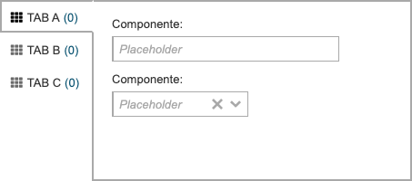

.. index:: Float Tabs

.. _ftabs:

Float Tabs
==========

Este componente manusea áreas independentes flutuantes (verticais). 

Requisitos
----------
       
=================================== ===============
``/framework/components/ftabs.js``                       
``/framework/components/shared.js`` :ref:`jsshared`     
=================================== ===============

.. note:: As páginas geradas por :ref:`phppagehelper` fazem, por defeito, o carregamento dos componentes necessários.  

----

Html do componente (tag)
------------------------

.. code:: html

    <fwk-ftabs>
        

           <i class="fas fa-th" style="margin-right: 5px"></i>
           <fwk-label value="???"></fwk-label>
           <fwk-text class="counter" color="blue" value="(0)"></fwk-label>
        

        

            component
            component
            ...
        

        ...
    </fwk-ftabs>

==================== ==================================== =========== =============== =======
Atributo             Descrição                            Obrigatório Opções          Default
==================== ==================================== =========== =============== =======
``id``               Identificador único do componente    Sim (?)    
``value``            Indentificador da tab seleccionada   Não              
``top``              Distância ao topo (posição absoluta) Não         "1", "2", ...   "200"
``hide``             Esconde componente                   Não         "true", "false" "false"          
``min-width``        Largura mínima do componente         Não         "1", "2", ...   "320"
``min-height``       Altura mínima do componente          Não         "1", "2", ...   "160"
``max-height``       Altura máxima do componente          Não         "1", "2", ...   content
``color``            Cor base do componente               Não         "blue", "gray"  "gray"
==================== ==================================== =========== =============== =======

.. important:: O atributo ``id`` só é obrigatório no caso de ser necessária a identificação do componente para interacção com qualquer uma das suas funcionalidades.

=========== =============== =========== =====================
Slot         Descrição      Obrigatório Observações
=========== =============== =========== =====================
``tab``     Etiqueta da tab Sim         :ref:`ftabs_tab_slot`
``content`` Componentes     Sim         Admite html
=========== =============== =========== =====================

.. important:: 

    O atributo ``id`` de uma slot ``tab`` tem de ser igual ao ``ìd`` da slot ``content`` que lhe correponde e só é obrigatório no caso de ser necessária a identificação da tab para interacção com qualquer uma das suas funcionalidades.

.. attention:: A ordem das slots no componente é, obrigatóriamente, a seguinte:

    #. ``tab``
    #. ``content`` 
    #. ``tab``
    #. ``content``

----

.. _ftabs_tab_slot:

Slot tab
--------

| A slot ``tab`` é um container de para um conjunto de elementos, qualquer um deles opcional.
| Por princípio terá a seguinte composição:

* Um icone: '<i>' ou :ref:`image`
*  Um texto: :ref:`label`
*  Um contador: :ref:``text`` (identificado pela classe **counter**)

=========== ========================== =========== =============== =======
Atributo    Descrição                  Obrigatório Opções          Default
=========== ========================== =========== =============== =======
``id``      Identificador único da tab  Não   
``hide``    Esconde tab                 Não        "true", "false" "false"          
=========== ========================== =========== =============== =======

.. important:: 

    O atributo ``id`` tem de ser igual ao ``id`` da slot ``content`` que lhe correponde e só é obrigatório no caso de ser necessária a identificação da tab para interacção com qualquer uma das suas funcionalidades.

----

Funcionalidades
---------------

Assumindo que exite um objecto instanciado com o componente:

.. code:: Javascript

    const obj_ftabs = FormHelper.getComponent('fwk_ftabs');

Seleccionar / desseleccionar
^^^^^^^^^^^^^^^^^^^^^^^^^^^^^^^
.. code:: Javascript

    obj_ftabs.value = '?'; (se estiver seleccionada, desselecciona-a)
    obj_ftabs.value = '';

Atribuir valor ao contador
^^^^^^^^^^^^^^^^^^^^^^^^^^
.. code:: Javascript

   obj_ftabs.counter('?key', '?value');

Ler valor (tab seleccionada)
^^^^^^^^^^^^^^^^^^^^^^^^^^^^
.. code:: Javascript

    let value = obj_ftabs.value;

Mostrar / esconder
^^^^^^^^^^^^^^^^^^
.. code:: Javascript

    obj_ftabs.hide = false;
    obj_ftabs.hide = true;

Mostrar / esconder tab
^^^^^^^^^^^^^^^^^^^^^^
.. code:: Javascript

    obj_ftabs.showTab('?');
    obj_ftabs.hideTab('?');

Ler estados
^^^^^^^^^^^
.. code:: Javascript

    let is_hide = obj_ftabs.hide;
    let is_tab_hide = obj_ftabs.isTabHide('?');

----

Referências
-----------

| :ref:`jsformhelper` é uma classe de auxílio às operações sobre formulários.