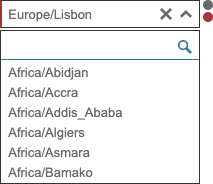

.. index:: Select

.. _select:

Select
======

Este componente selecciona **uma** opção.

Requisitos
----------
       
=================================== ===============
``/framework/components/select.js``                       
``/framework/components/shared.js`` :ref:`jsshared`     
=================================== ===============

.. note:: As páginas geradas por :ref:`phppagehelper` fazem, por defeito, o carregamento dos componentes necessários.  

----

Html do componente (tag)
------------------------

.. code:: html

    <fwk-select>
        texto
        [{},{},...]
    </fwk-select>

==================== ====================================== =========== =============== =======
Atributo             Descrição                              Obrigatório Opções          Default
==================== ====================================== =========== =============== =======
``id``               Identificador único do componente      Sim (?)    
``placeholder``      Placeholer do componente               Não              
``key-value``        Key identificativa do valor das opções Sim         
``key-text``         Key identificativa do texto das opções Sim    
``value``            Opção inicial seleccionada             Não                         ""
``filter``           Com filtro                             Não         "true", "false" "false"
``rows``             Linhas visíveis                        Não                         content
``mandatory``        Selecção obrigatória                   Não         "true", "false" "false"
``disable``          Inibe componente                       Não         "true", "false" "false" 
``hide``             Esconde componente                     Não         "true", "false" "false"     
``width``            Largura do componente                  Não                         "200"
``color``            Cor base do componente                 Não         "blue", "gray"  "gray"
``tooltip-position`` Posição do tooltip                     Não         "left", "right" "right"
``function``         Função a executar no evento onchange   Não   
==================== ====================================== =========== =============== =======

.. important:: O atributo ``id`` só é obrigatório no caso de ser necessária a identificação do componente para interacção com qualquer uma das suas funcionalidades.

==================== ======================= =========== ==========================
Slot                 Descrição               Obrigatório Observações
==================== ======================= =========== ==========================
``information``      Tooltip de informação   Não         Admite html
``options``          Opções para componente  Sim         :ref:`select_options_slot`
==================== ======================= =========== ==========================

----

Função de componente
--------------------

| O atributo ``function`` destina-se a definir a chamada a uma função global ou a um método de classe.
| A função recebe, como parâmetros, o valor da nova opção e o valor da opção anterior ``(new, old)``.
| Os formatos permitidos são:

======================= ==========================                                        
Função global (formato) Método de classe (formato)                             
======================= ==========================
function = "onchange"   function = "obj.onchange"                  
======================= ==========================

----

.. _select_options_slot:

Slot options
------------

A slot ``options`` é um array de objectos. Cada objecto corresponde a uma opção do componente e tem o seguinte formato:

.. code:: Javascript

    {"key": "???", "text": "???"}

=========== ================= ===========
Atributo    Descrição         Obrigatório
=========== ================= ===========
``key``     Valor para opção  Sim   
``text``    Texto da opção    Sim 
=========== ================= ===========

.. important:: 

    O nome dos atributos pode ser alterado desde que seja mantida a integridade com os valores de ``key-value`` e ``key-text``.

    | O componente disponibiliza uma funcionalidade para devolver o conjunto extra de atributos que sejam acrescentados a cada uma das opções:
    | exemplo: {"value": "???", "text": "???", **"attr1": true, "attr2": ["val1", "val2"], "attr3": {"at1": ?, "at2": "?"}**} 

----

Exemplos
--------

Carregamento html
^^^^^^^^^^^^^^^^^
.. code:: html

    <fwk-select id="user_timezone" placeholder="Selecione" key-value="code" key-text="timezone" value="Europe/Lisbon" 
                filter="true" rows="6" mandatory="true" function="onchange">
            
        texto 

        
[{"code":"Africa/Abidjan","timezone":"Africa/Abidjan"}, {"code":"Africa/Accra","timezone":"Africa/Accra"},
                             {"code":"Africa/Addis_Ababa","timezone":"Africa/Addis_Ababa"}, {"code":"Africa/Algiers","timezone":"Africa/Algiers"},
                             {"code":"Africa/Asmara","timezone":"Africa/Asmara"}, {"code":"Africa/Bamako","timezone":"Africa/Bamako"},
                             {"code":"Africa/Bangui","timezone":"Africa/Bangui"}, {"code":"Africa/Banjul","timezone":"Africa/Banjul"}]
        

        

    </fwk-select>

Carregamento Javascript
^^^^^^^^^^^^^^^^^^^^^^^
.. code:: Javascript

    var obj_select = FormHelper.getComponent('user_timezone');

    var options = [{"code":"Africa/Abidjan","timezone":"Africa/Abidjan"}, {"code":"Africa/Accra","timezone":"Africa/Accra"},
                             {"code":"Africa/Addis_Ababa","timezone":"Africa/Addis_Ababa"}, {"code":"Africa/Algiers","timezone":"Africa/Algiers"},
                             {"code":"Africa/Asmara","timezone":"Africa/Asmara"}, {"code":"Africa/Bamako","timezone":"Africa/Bamako"},
                             {"code":"Africa/Bangui","timezone":"Africa/Bangui"}, {"code":"Africa/Banjul","timezone":"Africa/Banjul"}];
    
    obj_select.fill({
        options: options,
        details: details,
        value: 'Europe/Lisbon',
        function_onchange: function (current_value, previous_value) {...})
    });

Carregamento Ajax
^^^^^^^^^^^^^^^^^
.. code:: Javascript

    var obj_ajax_helper = new AjaxHelper(); 
    var obj_reader_helper = new ReaderHelper();
    var obj_select = FormHelper.getComponent('user_timezone');
    
    var reader = {ajax: obj_ajax_helper, filter: obj_reader_helper, fully_qualified_class_name: '\\???\\???\\...\\???', action: '???'};
    obj_select.fill({    
        reader: reader,
        value: 'Europe/Lisbon',
        function_onchange: function (current_value, previous_value) {...})
    });

----

Funcionalidades
---------------

Assumindo que exite um objecto instanciado com o componente:

.. code:: Javascript

    const obj_select = FormHelper.getComponent('fwk_select');

Seleccionar / desseleccionar
^^^^^^^^^^^^^^^^^^^^^^^^^^^^
.. code:: Javascript

    obj_select.value = '?';
    obj_select.value = '';

Ler valor
^^^^^^^^^
.. code:: Javascript

    let value = obj_select.value;

Ler selecção (texto) 
^^^^^^^^^^^^^^^^^^^^
.. code:: Javascript

    let text = obj_select.selection;

Ler atributos extra
^^^^^^^^^^^^^^^^^^^
.. code:: Javascript

    let data = obj_select.data; (object)

Atribuir / cancelar obrigatoriedade
^^^^^^^^^^^^^^^^^^^^^^^^^^^^^^^^^^^
.. code:: Javascript

   obj_select.mandatory = true;
   obj_select.mandatory = false;

Mostrar / esconder
^^^^^^^^^^^^^^^^^^
.. code:: Javascript

    obj_select.hide = false;
    obj_select.hide = true;

Habilitar / inibir
^^^^^^^^^^^^^^^^^^
.. code:: Javascript

    obj_select.disable = false;
    obj_select.disable = true;

Atribuir erro
^^^^^^^^^^^^^
.. code:: Javascript

   obj_select.error = true; (apenas sinalizador)
   obj_select.error = '???? \n ???';

Cancelar erro
^^^^^^^^^^^^^
.. code:: Javascript

    obj_select.error = false;

Ler estados
^^^^^^^^^^^
.. code:: Javascript

    let is_hide = obj_select.hide;
    let is_disable = obj_select.disable;
    let is_mandatory = obj_select.mandatory;
    let has_error = obj_select.error;

----

Referências
-----------

| :ref:`jsformhelper` é uma classe de auxílio às operações sobre formulários.
| :ref:`jsajaxhelper` é uma classe de auxílio aos pediddos Ajax.
| :ref:`jsreaderhelper` é uma classe de auxílio às operações de leitura dos pedidos Ajax.