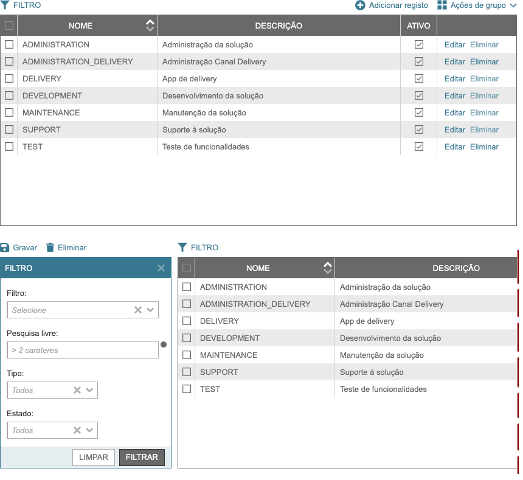

.. index:: Table

.. _table:

Table
=====

Este componente mostra uma lista de registos, possibilita filtro, ordena e executa procedimentos sobre o seu conteúdo.

Requisitos
----------
       
======================================= ================
``/framework/components/table.js``   
``/framework/components/dropbutton.js`` :ref:`dropbutton`   
``/framework/components/checkbox.js``   :ref:`checkbox`    
``/framework/components/shield.js``     :ref:`shield`                     
``/framework/components/shared.js``     :ref:`jsshared`     
======================================= ================

.. note:: As páginas geradas por :ref:`phppagehelper` fazem, por defeito, o carregamento dos componentes necessários.  

.. attention:: 

    | Utiliza as variável de sessionStorage com o nome igual ao id do componente para armazena o último filtro utilizado (exemplo: roles_list).

----

Html do componente (tag)
------------------------

.. code:: html

    <fwk-table>
        

        

        <fwk-component slot="table-top-action"><fwk-component>
        ...
        <fwk-component slot="table-bulk-action"><fwk-component>
        ...
        <fwk-component slot="filter-top-action"><fwk-component>
        ...
        

        ...
        <fwk-component slot="filter-action"><fwk-component>
        ...
    </fwk-table>

=========== ================================= =========== =============== =======
Atributo    Descrição                         Obrigatório Opções          Default
=========== ================================= =========== =============== =======
``id``      Identificador único do componente Sim (?)    
``disable`` Inibe componente                  Não         "true", "false" "false" 
``hide``    Esconde componente                Não         "true", "false" "false"     
``color``   Cor base do componente            Não         "blue", "gray"  "gray"
=========== ================================= =========== =============== =======

.. important:: O atributo ``id`` só é obrigatório no caso de ser necessária a identificação do componente para interacção com qualquer uma das suas funcionalidades.

===================== ============================ =========== ==============================
Slot                  Descrição                    Obrigatório Observações
===================== ============================ =========== ==============================
``config``            Configuração geral da tabela sim         :ref:`table_config_slot`
``columns``           Configuralçao das colunas    Sim         :ref:`table_columns_slot`
``table-top-action``  Acções de topo da tabela     Não         :ref:`table_top_action_slot`
``table-bulk-action`` Acções de grupo da tabela    Não         :ref:`table_bulk_action_slot`
``rows``              Linhas de dados              Não         :ref:`table_rows_slot`
``filter-top-action`` Acções de topo do filtro     Não         :ref:`filter_top_action_slot`
``filter-component``  Componentes do filtro        Sim         :ref:`filter_component_slot`
``filter-action``     Acções do filtro             Sim         :ref:`filter_action_slot` 
===================== ============================ =========== ==============================

.. attention:: A ordem das slots no componente é, obrigatóriamente, a seguinte:

    #. ``config``
    #. ``columns`` 
    #. ``table-top-action``
    #. ``table-bulk-action``
    #. ``rows``
    #. ``filter-top-action``
    #. ``filter-component``
    #. ``filter-action``

----

.. _table_config_slot:

Slot config
-----------

A slot ``config`` é um objecto. Cada propriedade do objecto corresponde a um atributo da tabela.

.. code:: Javascript

    {"filter":???, "actions":???, "bulk":???, "row_actions":???, "rows":???, "template_height":???, "page":???}

====================== ======================================== =========== =========== ==========
Atributo               Descrição                                Obrigatório Opções      Default
====================== ======================================== =========== =========== ==========
``filter``             Com filtro                               Não         true, false false
``actions``            Com acções de topo                       Não         true, false false
``bulk``               Com acções de grupo                      Não         true, false false
``row_actions``        Com acções de linha                      Não         true, false false
``rows``               Mínimo de linhas visíveis                Não         1, 2, ...   ---
``template_height``    | Acompanha o footer da página           Não         1, 2, ...   175                                                  
                       | Define a altura ocupada pelo template                         
``page``               Paginação (nº de linhas)                 Não         1, 2, ...   calculadas
====================== ======================================== =========== =========== ==========

.. _table_columns_slot:

Slot columns
------------

A slot ``columns`` é um objecto. Cada propriedade do objecto corresponde a uma coluna da tabela.

.. code:: Javascript

    {"alias.column": {"title": "???", "width":???, "order":???, "tooltip":???, align":"???"}, 
     ...,
     "_actions": {"width":???, align":"???"}
    }

====================== ============================== =========== ========================= ==========
Atributo               Descrição                      Obrigatório Opções                    Default
====================== ============================== =========== ========================= ==========
``alias.column``       Correspondência com DB         Sim         Não         
``title``              Título da coluna               Não         true, false               false
``width``              Largura da coluna              Não         true, false               false
``order``              Coluna com ordenação           Não         true, false               false
``tooltip``            Coluna com tooltip             Não         true, false               false
``align``              Alinhamento do conteúdo        Não         "left", "center", "right" "left"                                                                 
``_actions``           Coluna para acções de linha    Não         
====================== ============================== =========== ========================= ==========

.. _table_top_action_slot:

Slot table-top-action
---------------------

| A slot ``table-top-action`` é um componente, habitualmente um :ref:`button` ou :ref:`dropbutton`.
| Existirá uma slot deste tipo para cada componente que se pretenda adicionar à área de acções no topo a tabela.

.. code:: html

    <fwk-component slot="table-top-action"></fwk-component> 

.. _table_bulk_action_slot:

Slot table-bulk-action
----------------------

A slot ``table-bulk-action`` é um componente, habitualmente um :ref:`button`.
| Existirá uma slot deste tipo para cada componente que se pretenda adicionar ao :ref:`dropbutton` de acções de grupo.

.. code:: html

    <fwk-component slot="table-bulk-action"></fwk-component> 

.. _table_rows_slot:

Slot rows
---------

A slot ``rows`` é um array de objectos usado apenas para carregamento html . Cada objecto corresponde a uma linha de dados e tem o seguinte formato:

.. code:: Javascript

    {"permissions":["?,?"], 
     "key":"???", 
     "values":{"alias.column":???, ...}, 
     "_data": {"attr1": true, "attr2": ["val1", "val2"], "attr3": {"at1": ?, "at2": "?"}},
     "_actions": ["component",..."]
     }

.. tip::

    | Se as linhas tiverem origem num array (backend), as aspas ( **"** ) e tags( **<?>** ) têm de ter especial atenção.
    | Exemplo php: **json_encode($table_rows, JSON_HEX_QUOT | JSON_HEX_TAG)**

================ ============================== =========== ==================== =======
Atributo               Descrição                Obrigatório Opções               Default
================ ============================== =========== ==================== =======
``permissions``  Permissões para operações bulk Não         definidas livremente todas   
``key``          Identificador único da linha   Sim                         
``values``       Valores para colunas           Sim                         
``alias.column`` Correspondência com DB         Sim           
``_data``        Conjunto extra de atributos    Não
``_actions``     Acções para linha              Não
================ ============================== =========== ==================== =======

.. important:: 

    O componente disponibiliza uma funcionalidade para devolver o conjunto extra de atributos que sejam acrescentados a cada uma das linhas.

.. _filter_top_action_slot:

Slot filter-top-action
----------------------

| A slot ``filter-top-action`` é um componente, habitualmente um :ref:`button` ou :ref:`dropbutton`.
| Existirá uma slot deste tipo para cada componente que se pretenda adicionar à área de acções no topo do filtro.

.. code:: Javascript

    <fwk-component slot="filter-top-action"></fwk-component> 

.. _filter_component_slot:

Slot filter-component
---------------------

| A slot ``filter-component`` é um componente ou um agrupador de componentes. 
| Admite html.
| Existirá uma slot deste tipo para cada componente que se pretenda adicionar à área de filtro.

.. code:: html

    <fwk-component slot="filter-top-action"></fwk-component> 

    

        <fwk-label></fwk-label>
        <fwk-component></fwk-component>
    

.. _filter_action_slot:

Slot slot filter-action
-----------------------

| A slot ``filter-top-action`` é um componente, habitualmente um :ref:`formbutton`.
| Existirá uma slot deste tipo para cada componente que se pretenda adicionar à área de acções do filtro.

.. code:: html

    <fwk-component slot="filter-action"></fwk-component> 

----

Exemplos
--------

Carregamento html
^^^^^^^^^^^^^^^^^
.. code:: html

    <fwk-table id="roles_list">             

        
{"filter":true, "actions":true, "bulk":true, "row_actions":true}

        
{"sr.name": {"title":"NOME", "width":230, "order":true}, 
                             "sr.description": {"title":"DESCRIÇÃO", "width":400, "tooltip": true}, 
                             "sr.active": {"title":"ATIVO", "width":60, "align":"center"}, 
                              "_actions": {"width":130}}
        

        <fwk-button slot="table-top-action" value="Adicionar registo" color="blue" function="addRecord">
            <i slot="icon" class="fas fa-plus-circle fa-lg"></i>
        </fwk-button>

        <fwk-button slot="table-bulk-action" value="Eliminar Selecionados" color="blue" function="confirmDeleteBulk">
            <i slot="icon" class="fas fa-trash"></i>
        </fwk-button>

        
[{"key":"101", "values": {"sr.name":"TEST", "sr.description":"Teste de funcionalidades", "sr.active":true}, 
                           "_data":{"last_update": "2021-01-01"},
                           "_permissions":["u","d"], 
                           "_data": {"sr.code","X2536"}, 
                           "_actions": ["<fwk-button value=\"Editar\" color=\"blue\" function='{\"editRecord\":[101]}'><\/fwk-button>",
                                        "<fwk-button value=\"Eliminar\" color=\"blue\" function='{\"confirmDeleteRecord\":[101, \"TEST\"]}'><\/fwk-button>"]},
                          {"key":"3","values": {"sr.name":"SUPPORT", "sr.description":"Suporte à solução", "sr.active":true},
                           "_data":{"last_update": "2021-01-01"},
                           "_data": {"sr.code","X2537"}, 
                           "_permissions":["u"],
                           "_actions":["<fwk-button value=\"Editar\" color=\"blue\" function='{\"editRecord\":[3]}'><\/fwk-button>",
                                       "<fwk-button value=\"Eliminar\" color=\"blue\" disable=\"true\" function='{\"confirmDeleteRecord\":[3, \"SUPPORT\"]}'><\/fwk-button>"]}]
                            ...   
        

        <fwk-button id="filter_save" slot="filter-top-action" value="Gravar" color="blue" function="obj_filter_helper.confirmSave">
            <i slot="icon" class="fas fa-save fa-lg"></i>
        </fwk-button>
        <fwk-button id="filter_delete" slot="filter-top-action" visible="false" value="Eliminar" color="blue" function="obj_filter_helper.confirmDelete">
            <i slot="icon" class="fas fa-trash"></i>
        </fwk-button>

        

            <fwk-label value="Filtro:"></fwk-label>
            <fwk-select id="filter_id" key-value="id" key-text="name" placeholder="Selecione" width="250" function="obj_filter_helper.applySaved">
                
[{},{},...]

            </fwk-select>
        

        

            <fwk-label value="Pesquisa livre:"></fwk-label>
            <fwk-input id="filter_search" type="text" placeholder="> 2 carateres')" maxlength="50" width="250" tooltip-position="left">
                texto
            </fwk-input>
        

        

            <fwk-label value="Tipo:"></fwk-label>
            <fwk-select id="role_system" key-value="value" key-text="description" placeholder="Todos" width="150">
                
[{},{}]

            </fwk-select>
        

        

            <fwk-label value="Estado:"></fwk-label>
            <fwk-select id="role_active" key-value="value" key-text="description" placeholder="Todos" width="150">
                
[{},{}]

            </fwk-select>
        

        <fwk-formbutton slot="filter-action" value="LIMPAR'" color="white" function="resetFilterComponents"></fwk-formbutton>
        <fwk-formbutton slot="filter-action" value="FILTRAR" color="gray" function="applyFilter"></fwk-formbutton>

    </fwk-table>

.. tip::

    | Se o conteúdo da slot ``nodes`` tiver origem num array deverá ser convertida para json utilizando as opções ``JSON_HEX_QUOT | JSON_HEX_TAG``.
    | Exemplo: ``<?= json_encode($table_rows, JSON_HEX_QUOT | JSON_HEX_TAG) ?>``.

Carregamento Javascript
^^^^^^^^^^^^^^^^^^^^^^^
.. code:: Javascript

    var obj_table = FormHelper.getComponent('roles_list');

    var rows = [{"key":"101", "values": {"sr.name":"TEST", "sr.description":"Teste de funcionalidades", "sr.active":true}, 
                 "_data": {"last_update": "2021-01-01"},
                 "_permissions":["u","d"], 
                 "_data": {"sr.code","X2536"}, 
                 "_actions": ["<fwk-button value=\"Editar\" color=\"blue\" function='{\"editRecord\":[101]}'><\/fwk-button>",
                             "<fwk-button value=\"Eliminar\" color=\"blue\" disable=\"false\" function='{\"confirmDeleteRecord\":[101, \"TEST\"]}'><\/fwk-button>"]},
                 {"key":"3","values": {"sr.name":"SUPPORT", "sr.description":"Suporte à solução", "sr.active":true},
                 "_data": {"last_update": "2021-01-01"},
                 "_permissions":["u"],
                 "_data": {"sr.code","X2537"}, 
                 "_actions":["<fwk-button value=\"Editar\" color=\"blue\" function='{\"editRecord\":[3]}'><\/fwk-button>",
                             "<fwk-button value=\"Eliminar\" color=\"blue\" disable=\"true\" function='{\"confirmDeleteRecord\":[3, \"SUPPORT\"]}'><\/fwk-button>"]}];
 
    obj_table.fill({records: rows});

Carregamento Ajax
^^^^^^^^^^^^^^^^^
.. code:: Javascript

    var obj_ajax_helper = new AjaxHelper(); 
    var obj_reader_helper = new ReaderHelper();
    var obj_table = FormHelper.getComponent('roles_list');
    
    var reader = {ajax: obj_ajax_helper, filter: obj_reader_helper, fully_qualified_class_name: '\\???\\???\\...\\???', action: '???'};
    obj_table.fill({    
        reader: reader
    });

----

Funcionalidades
---------------

Assumindo que exite um objecto instanciado com o componente:

.. code:: Javascript

    const obj_table = FormHelper.getComponent('fwk_table');

Seleccionar não seleccionados
^^^^^^^^^^^^^^^^^^^^^^^^^^^^^
.. code:: Javascript

    obj_table.select();

Desseleccionar seleccionados
^^^^^^^^^^^^^^^^^^^^^^^^^^^^
.. code:: Javascript

    obj_table.unselect();

Ler identificadores de linhas seleccionadas
^^^^^^^^^^^^^^^^^^^^^^^^^^^^^^^^^^^^^^^^^^^
.. code:: Javascript

    let ids = obj_table.getSelectedKeys(); (array)
    let ids = obj_table.getSelectedKeys('permission'); (array)

.. note:: Pode ou não ser validada uma permissão de linha para filtrar o resultado.

Ler atributos extra de linha
^^^^^^^^^^^^^^^^^^^^^^^^^^^^
.. code:: Javascript

    let data = obj_table.data; (object)

Mostrar / esconder
^^^^^^^^^^^^^^^^^^
.. code:: Javascript

    obj_table.hide = false;
    obj_table.hide = true;

Habilitar / inibir
^^^^^^^^^^^^^^^^^^
.. code:: Javascript

    obj_table.disable = false;
    obj_table.disable = true;

Ler estados
^^^^^^^^^^^
.. code:: Javascript

    let is_hide = obj_table.hide;
    let is_disable = obj_table.disable;

----

Referências
-----------

| :ref:`jsformhelper` é uma classe de auxílio às operações sobre formulários.
| :ref:`jsajaxhelper` é uma classe de auxílio aos pediddos Ajax.
| :ref:`jsreaderhelper` é uma classe de auxílio às operações de leitura dos pedidos Ajax.